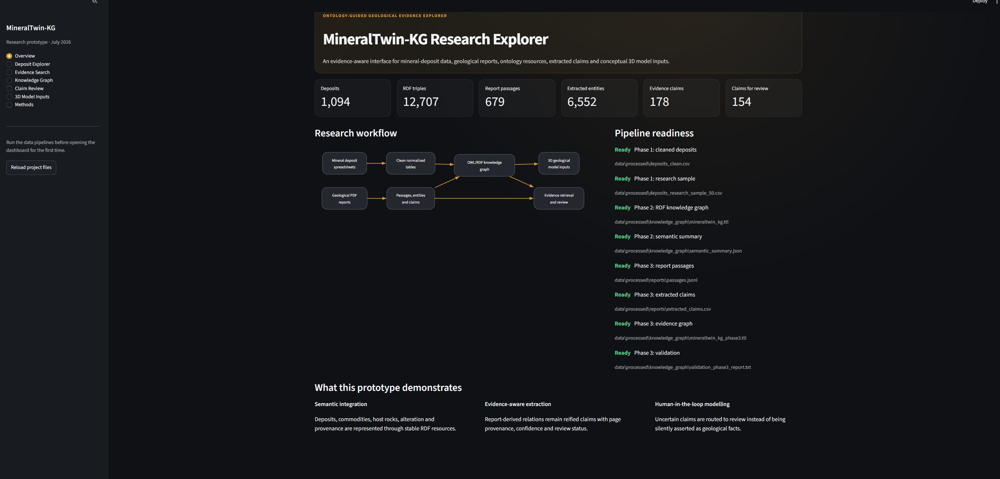
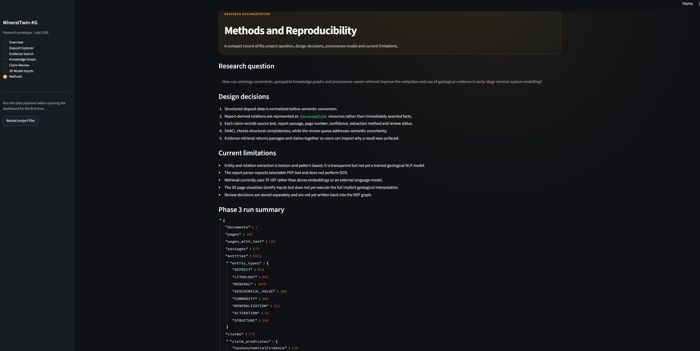
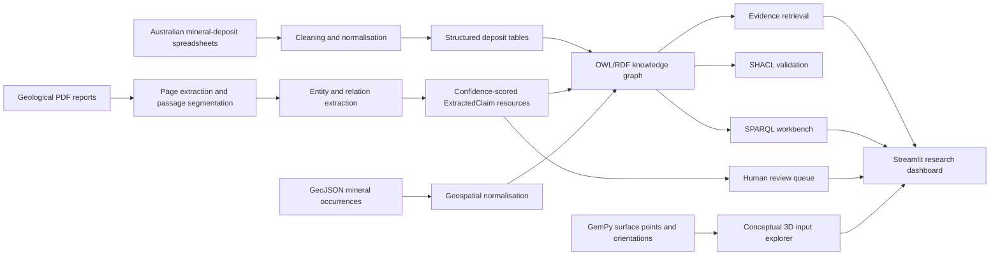

# MineralTwin-KG

## Ontology-Guided Geological Evidence Explorer

MineralTwin-KG is an independent research prototype that combines structured mineral-deposit data, geological report text, semantic technologies and conceptual 3D geological inputs in one evidence-aware exploration environment.

The system converts heterogeneous geological records into an RDF knowledge graph, extracts provenance-linked claims from reports, validates graph structure with SHACL, supports SPARQL and natural-language evidence retrieval, and routes uncertain relationships into a human review workflow.

> **Research question:** How can ontology constraints, geospatial knowledge graphs and provenance-aware retrieval improve the extraction and use of geological evidence in early-stage mineral-system modelling?


---

## Why this project exists

Coordinates alone do not explain what an observation means, where it came from, or how confidently it should be used.

The idea grew from an earlier maritime subproject in which vessel-location observations had to be connected with contextual knowledge about ships, routes and operational conditions. MineralTwin-KG transfers that design principle to mineral exploration: spatial observations become useful when they are connected to domain concepts, documentary evidence, provenance, uncertainty and model elements.

The project is designed as a compact demonstration of work at the intersection of:

- geological data integration
- domain ontologies and knowledge representation
- report-level NLP and information extraction
- provenance and uncertainty modelling
- geospatial exploration
- evidence-grounded retrieval
- human-in-the-loop validation
- semantic links to 3D geological modelling

---

## Current demonstration run

The current local run uses the Australian mineral-deposit compilation, one lithium-pegmatite report and the GemPy conceptual fault-model inputs.

| Output | Current run |
|---|---:|
| Structured mineral deposits | 1,094 |
| RDF triples | 12,707 |
| Report passages | 679 |
| Extracted geological entities | 6,552 |
| Extracted evidence claims | 178 |
| Claims routed to review | 154 |

These values are generated outputs, not fixed project constants. They may change when the source data, lexicon, report corpus or extraction rules change.

---

## Dashboard

### Research overview

The overview reports pipeline readiness, dataset coverage and the main semantic workflow.



### Deposit Explorer

The deposit explorer filters the Australian compilation by commodity, state, province and search term. It links map locations to structured deposit records, host-rock data, alteration assemblages and associated igneous rocks.


### Geological Evidence Search

Evidence search retrieves relevant report passages and shows the structured claims attached to each passage, including confidence, extraction method, page provenance and review status.


### Knowledge Graph Workbench

The workbench reports graph statistics, RDF type distributions and resource neighbourhoods, and supports read-only SPARQL competency queries.


### Human review queue

Low-confidence claims are not silently promoted into accepted geological knowledge. They are routed to a review queue where a reviewer can accept, reject or escalate them to a domain expert.


### Conceptual 3D model inputs

The 3D view displays the GemPy surface points, orientations, formations and fault observations used as modelling evidence. The current release visualises inputs; it does not yet execute full implicit geological interpolation.


### Methods and reproducibility

The methods page records the research question, design decisions, current limitations and the latest pipeline summary.



---

## System architecture



---

## Semantic model

MineralTwin-KG uses a compact mineral-systems ontology rather than attempting to reproduce the full geological domain.

### Core classes

- `MineralDeposit`
- `MineralOccurrence`
- `Commodity`
- `GeologicalProvince`
- `GeologicalUnit`
- `Lithology`
- `AlterationAssemblage`
- `GeologicalStructure`
- `Mineralization`
- `Mineral`
- `GeochemicalObservation`
- `EvidenceDocument`
- `ReportPassage`
- `ExtractedClaim`
- `ExtractionActivity`
- `Geometry`

### Representative relationships

- `containsCommodity`
- `locatedInProvince`
- `hasHostRock`
- `hasLithology`
- `hasAlteration`
- `hostedBy`
- `controlledByStructure`
- `containsMineral`
- `hasGeochemicalEvidence`
- `supportedByPassage`
- `mentionsEntity`
- `claimSubject`
- `claimPredicate`
- `claimObject`
- `confidenceScore`
- `reviewStatus`

### Standards used

- RDF and RDFS for graph representation
- OWL for ontology semantics
- SHACL for structural validation
- SPARQL for graph querying
- PROV-O for provenance
- GeoSPARQL-compatible geometry representation

---

## Evidence and uncertainty model

Report-derived relations are represented as first-class `ExtractedClaim` resources instead of being asserted immediately as unquestioned facts.

Each claim records:

- subject, predicate and object
- source document
- source page and passage
- source sentence
- extraction method
- confidence score
- review status
- provenance link to the extraction activity

Conceptual example:

```turtle
@prefix mt: <https://example.org/mineraltwin/ontology/> .
@prefix res: <https://example.org/mineraltwin/resource/> .
@prefix prov: <http://www.w3.org/ns/prov#> .

res:claim-example
    a mt:ExtractedClaim ;
    mt:claimSubject res:lithium-mineralisation ;
    mt:claimPredicate mt:hostedBy ;
    mt:claimObject res:pegmatite ;
    mt:confidenceScore 0.90 ;
    mt:reviewStatus "accepted-auto" ;
    mt:sourceText "Lithium mineralisation is hosted within pegmatite ..." ;
    mt:supportedByPassage res:passage-example ;
    prov:wasDerivedFrom res:passage-example .
```

This design separates documentary evidence, extracted interpretation and accepted knowledge.

---

## Repository structure

```text
MineralTwin-KG/
├── .streamlit/
│   └── config.toml
├── data/
│   ├── documentation/          # Source documentation
│   ├── gempy/                 # Surface points and orientations
│   ├── lexicons/              # Geological term dictionaries
│   ├── processed/             # Generated outputs, ignored by Git
│   ├── raw/                   # Structured source datasets
│   └── reports/               # Geological PDF reports
├── img/                       # README screenshots
├── ontology/
│   ├── mineraltwin.ttl        # OWL/RDF ontology
│   └── shapes.ttl             # SHACL shapes
├── queries/                   # SPARQL competency queries
├── src/
│   ├── config.py
│   ├── ingestion.py
│   ├── semantic_model.py
│   ├── validation.py
│   ├── report_extraction.py
│   ├── domain_extraction.py
│   ├── claim_graph.py
│   ├── retrieval.py
│   └── dashboard_data.py
├── tests/
├── ask_evidence.py            # Command-line evidence retrieval
├── dashboard.py               # Streamlit application
├── run_pipeline.py            # Phase 1: ingestion and cleaning
├── run_semantic_pipeline.py   # Phase 2: RDF and SHACL
├── run_phase3.py              # Phase 3: reports, entities and claims
├── requirements.txt
├── requirements-semantic.txt
├── requirements-phase3.txt
├── requirements-dashboard.txt
├── requirements-full.txt
└── pytest.ini
```

---

## Data sources

The project is designed around publicly available geological resources. Third-party datasets and reports remain governed by their original licences and terms. This repository does not relicense them.

### Australian mineral deposits

- Dataset landing page: <https://ecat.ga.gov.au/geonetwork/srv/api/records/78075f6e-ca5c-4414-af23-bb2058f0fa26>
- Main spreadsheet: <https://d28rz98at9flks.cloudfront.net/149917/149917_01_1.xlsx>
- Dataset documentation: <https://d28rz98at9flks.cloudfront.net/149917/149917_00_0.pdf>

Supporting spreadsheets used by the pipeline include deposit classification, tectonic provinces, mineral abbreviations and commodity/endowment calculations.

### Mineral occurrences

- Geoscience Australia collection: <https://linkeddata.pid.geoscience.gov.au/collections/mo?f=html>
- GeoJSON endpoint: <https://linkeddata.pid.geoscience.gov.au/collections/mo/items?f=json>

### Geological report corpus

- MRIWA project page: <https://www.mriwa.wa.gov.au/research-projects/project-portfolio/geology-mineralogy-and-metallurgy-of-ematerials-deposits-in-wa/>
- Lithium-pegmatite report PDF: <https://www.mriwa.wa.gov.au/wp-content/uploads/2026/03/MRIWA-Report-M532-Geology-Mineralogy-and-Metallurgy-of-eMaterial-Resources-in-WA.pdf>

### GemPy model inputs

- GemPy data repository: <https://github.com/cgre-aachen/gempy_data>
- Fault-model tutorial: <https://docs.gempy.org/examples/geometries/e05_fault.html>
- Surface points: <https://raw.githubusercontent.com/cgre-aachen/gempy_data/master/data/input_data/jan_models/model5_surface_points.csv>
- Orientations: <https://raw.githubusercontent.com/cgre-aachen/gempy_data/master/data/input_data/jan_models/model5_orientations.csv>

### Recommended public-repository policy

For a lightweight and licence-conscious GitHub repository, keep the code, ontology, queries, lexicon, tests and screenshots under version control. Do not commit generated outputs, large PDFs or third-party raw datasets unless their terms permit redistribution. Instead, provide the source links above and let users place the files locally.

---

## Installation

### Prerequisites

- Python 3.11 or newer
- Git
- A PDF containing selectable text

### Windows PowerShell

```powershell
py -m venv .venv
.\.venv\Scripts\Activate.ps1
python -m pip install --upgrade pip
pip install -r requirements-full.txt
pip install -r requirements-dashboard.txt
```

When PowerShell blocks virtual-environment activation:

```powershell
Set-ExecutionPolicy -Scope Process -ExecutionPolicy Bypass
.\.venv\Scripts\Activate.ps1
```

### macOS or Linux

```bash
python3 -m venv .venv
source .venv/bin/activate
python -m pip install --upgrade pip
pip install -r requirements-full.txt
pip install -r requirements-dashboard.txt
```

---

## Local data setup

Place the source files in the following locations:

```text
data/
├── documentation/
│   └── australian_deposits_documentation.pdf
├── gempy/
│   ├── model5_orientations.csv
│   └── model5_surface_points.csv
├── raw/
│   ├── australian_mineral_deposits.xlsx
│   ├── commodity_endowment_calculations.xlsx
│   ├── deposit_classification.xlsx
│   ├── mineral_abbreviations.xlsx
│   ├── mineral_occurrences_sample.geojson
│   └── tectonic_provinces.xlsx
└── reports/
    └── MRIWA_Report_M532_Lithium_Pegmatites.pdf
```

The report filename may differ. Phase 3 processes every `.pdf` file found in `data/reports/`.

---

## Run the complete pipeline

Run the phases in order from the repository root.

### Phase 1: ingest and normalise the structured data

```bash
python run_pipeline.py
```

Main outputs:

```text
data/processed/deposits_clean.csv
data/processed/deposits_research_sample_50.csv
data/processed/host_rocks.csv
data/processed/associated_igneous_rocks.csv
data/processed/alterations.csv
data/processed/mineral_occurrences_normalized.geojson
data/processed/data_quality_report.json
```

### Phase 2: build and validate the semantic graph

```bash
python run_semantic_pipeline.py
```

Main outputs:

```text
data/processed/knowledge_graph/mineraltwin_kg.ttl
data/processed/knowledge_graph/mineraltwin_kg.jsonld
data/processed/knowledge_graph/semantic_summary.json
data/processed/knowledge_graph/validation_report.ttl
data/processed/knowledge_graph/validation_report.txt
data/processed/knowledge_graph/example_query_results.json
```

The script exits with a non-zero status when SHACL validation fails.

### Phase 3: extract report evidence and build claim resources

```bash
python run_phase3.py
```

Main outputs:

```text
data/processed/reports/documents.json
data/processed/reports/passages.jsonl
data/processed/reports/extracted_entities.csv
data/processed/reports/extracted_claims.csv
data/processed/reports/review_queue.csv
data/processed/knowledge_graph/mineraltwin_kg_phase3.ttl
data/processed/knowledge_graph/mineraltwin_kg_phase3.jsonld
data/processed/knowledge_graph/validation_phase3_report.txt
data/processed/knowledge_graph/retrieval_demo.json
data/processed/knowledge_graph/phase3_summary.json
```

### Phase 4: start the dashboard

```bash
streamlit run dashboard.py
```

Open the local URL printed by Streamlit, usually:

```text
http://localhost:8501
```

---

## Command-line evidence retrieval

```bash
python ask_evidence.py "Which passages discuss lithium mineralisation hosted by pegmatite?" --top-k 5
```

Other example questions:

```bash
python ask_evidence.py "What geological structures control mineralisation?"
python ask_evidence.py "Which alteration types are associated with lithium mineralisation?"
python ask_evidence.py "Where are spodumene and pegmatite mentioned together?"
```

The output includes the source document, page, passage, retrieval score and attached structured claims.

---

## SPARQL competency questions

The repository includes queries for questions such as:

1. Which deposits contain a selected commodity?
2. Which lithologies host the deposits?
3. How many deposits occur in each geological province?
4. Which alteration assemblages are associated with each deposit?
5. Which sources support each deposit record?
6. Which extracted claims exceed or fall below a confidence threshold?
7. Which report passages support a particular relation?
8. How many entities were extracted for each geological category?
9. Which claims require expert review?
10. Which claim predicates are most frequent?

Example:

```sparql
PREFIX mt: <https://example.org/mineraltwin/ontology/>
PREFIX rdfs: <http://www.w3.org/2000/01/rdf-schema#>

SELECT ?deposit ?depositLabel ?commodityLabel
WHERE {
  ?deposit a mt:MineralDeposit ;
           rdfs:label ?depositLabel ;
           mt:containsCommodity ?commodity .
  ?commodity rdfs:label ?commodityLabel .
  FILTER(CONTAINS(LCASE(STR(?commodityLabel)), "lithium"))
}
ORDER BY ?depositLabel
```

---

## Testing

Run all automated tests with:

```bash
python -m pytest -q
```

The tests cover:

- structured-data ingestion
- required output files
- RDF graph construction
- SHACL validation
- report and passage extraction
- geological entity and claim extraction
- evidence retrieval
- dashboard data loading

---

## Design decisions

1. Structured deposit records are cleaned before semantic conversion.
2. Stable URIs are generated for deposits and related resources.
3. Report-derived relationships are reified as `ExtractedClaim` resources.
4. Every claim retains document, page, passage, confidence and extraction provenance.
5. SHACL checks structural completeness, while the review queue handles semantic uncertainty.
6. Evidence retrieval returns source passages and claims together.
7. The interface exposes uncertainty rather than hiding it behind fluent generated text.
8. The 3D module is explicitly presented as conceptual input visualisation until full GemPy interpolation is implemented.

---

## Current limitations

- Entity and relation extraction is lexicon- and pattern-based, not a trained geological NLP model.
- PDF parsing expects selectable text and does not perform OCR.
- Retrieval uses TF-IDF rather than dense embeddings or an external language model.
- The current report corpus is small and focused on lithium pegmatites.
- Many low-confidence claims require geological expert review.
- Review decisions are saved separately and are not yet promoted back into the RDF graph.
- GeoSPARQL-compatible geometries are represented, but advanced spatial reasoning is limited.
- The 3D page visualises GemPy inputs but does not yet run full implicit interpolation or uncertainty simulation.
- The prototype is not a mineral-resource estimation, exploration decision or production system.

---

## Roadmap

- [ ] Add full GemPy model execution and ontology-to-model element mapping
- [ ] Write accepted review decisions back into a curated RDF graph
- [ ] Add dense retrieval and graph-grounded RAG
- [ ] Expand the report corpus and benchmark extraction quality
- [ ] Add manually annotated evaluation data for precision, recall and F1
- [ ] Improve entity normalisation and synonym handling
- [ ] Add GeoSPARQL spatial filters and proximity queries
- [ ] Add provenance-aware comparison across multiple reports
- [ ] Package the pipeline as a reproducible command-line application
- [ ] Deploy a public demonstration without redistributing restricted source data

---

## Responsible use

MineralTwin-KG is a research and portfolio prototype. Extracted statements may be incomplete, ambiguous or incorrect. They must not be used as geological, financial, environmental, safety or investment advice. Any real exploration workflow requires qualified domain review and validation against authoritative source material.

---

## Attribution and project status

This is an independent project developed by **Tathagata Ghosh**. It is not an official project of RWTH Aachen University, DTXplore, Geoscience Australia, MRIWA, the Geological Survey of Western Australia or the GemPy development team.

Third-party names and resources are referenced only to identify the original data, software and documentation sources.

- GitHub: <https://github.com/tghosh12101997>
- LinkedIn: <https://www.linkedin.com/in/t-ghosh>
- Portfolio: <https://ghoshtathagata.de/>

---

## License

No open-source licence is granted by this README alone. Add a `LICENSE` file before public release if you want others to reuse the source code.

Third-party datasets, reports and software remain subject to their original licences and terms.

---

## Citation

When referencing this prototype, use:

```text
Ghosh, T. (2026). MineralTwin-KG: Ontology-Guided Geological Evidence Explorer.
Independent research prototype.
```
